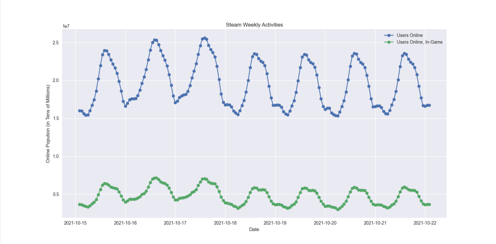
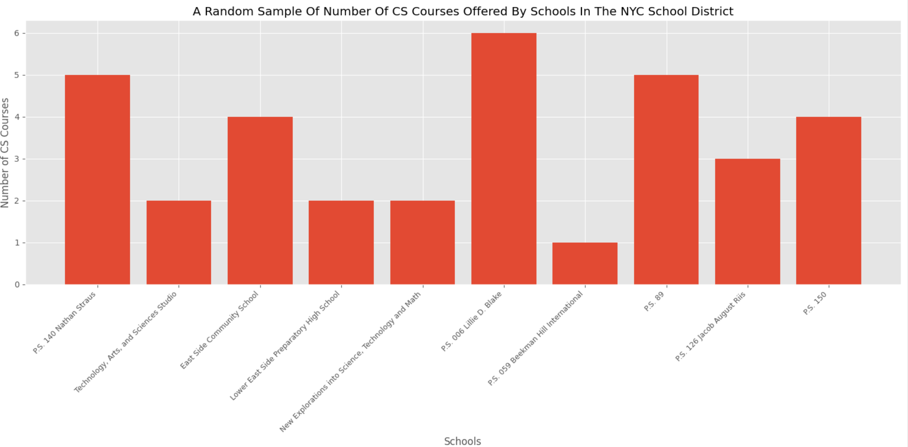

# Data Visualisations
This is a small repository for me to implement my simply Data Visualisation skills through Python.
 
 
 
**Steam Population Chart from 10/15/2021 to 10/22/2021 (Weekly)**

This chart demonstrates the fluctuation Steam's online population throughout a week: Y-axis demonstrates the number of players in tens of millions; X-axis demonstrates the date throughout the week. 
 
 
As shown, the blue line indicates the total amount of online individuals during the time and the green line tells the population who are both online and in-game at the same time.
 
 
[Data Source](https://steamdb.info/graph/)
 
 
 
**General Skim Of Amount Of CS Courses Offered at Schools Within The NYC School District 2016-2017**

Although this chart does not show the full dataset of schools in NYC that offer CS coures, it does shows a good average as the margin does not exceed 1-2. 
 
 
Y-axis demonstrates the number of courses at per school; X-axis demonstrates each respective school.
 
 
[Data Source](https://catalog.data.gov/dataset/2016-2017-computer-science-report/)
 
 
 
[Project Instructions](https://github.com/mikeizbicki/cmc-csci040/blob/2021fall/hw_02/README.md)
